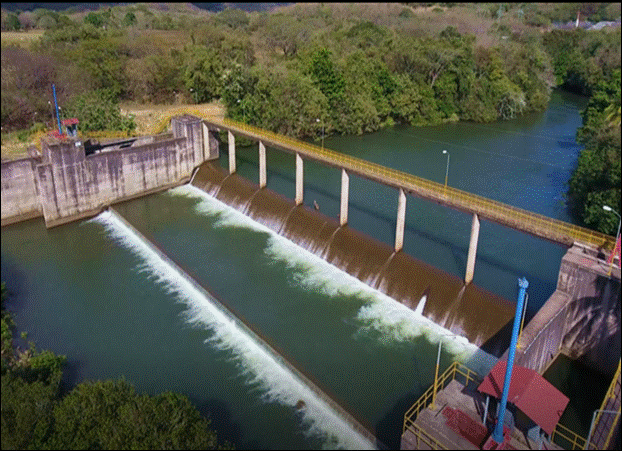
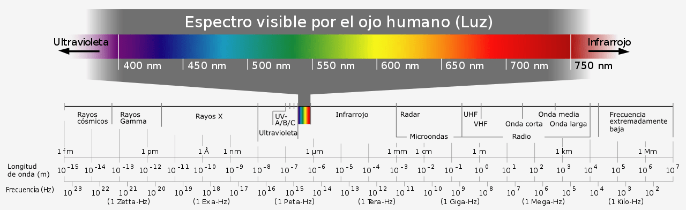

#####                                                                                                                      Carlos Zúñiga Álvarez / B79523
# Introducción.
La zona del Pacífico Norte, que comprende principalmente la provincia de Guanacaste, es muy importante en aspectos económicos, sociales, culturales; para nuestro país, ya que, es una de las zonas con más auge turístico, debido a su enorme belleza. Pero también, es muy relevante en temas agrícolas, donde la producción de arroz y frijol, por ejemplo, está muy extendida y es característica de la zona, siendo dos productos esenciales en la dieta del costarricense.  
En términos de esta investigación, la zona de interés comprende los alrededores de la cuenca del río Tempisque, identificando zonas implementadas para la agricultura, se realizará un análisis de vegetación de estas áreas, para así identificar los períodos del año, que abarcan desde el 2018 al 2020, donde el clima es más determinante hacia los cultivos, por ejemplo, el período seco de Guanacaste, que es tan extenso e intenso. A raíz de esto, se implementó el Distrito de Riego Arenal-Tempisque (DRAT), que consiste en la distribución del riego de agua sobre fincas utilizadas para la agricultura, con el fin de no perder las cosechas en los períodos de época seca (Wong, 2021).   
  
_Presa derivadora Ing. Miguel Pablo Dengo Benavides en el cauce del río Magdalena._

Todo esto se realizará con la ayuda de imágenes satelitales (Landsat 8) y con el Google Earth Engine (GEE). Mediante índices, donde se podrá identificar el estado de la vegetación. Por ejemplo, el índice de vegetación (NDVI), donde esta, según Pedro Muñoz (2013), ayudará a identificar zonas con ausencia de vegetación, donde los valores negativos indican superficies con poca vegetación. Otro índice a utilizar, es el índice de vegetación mejorado (EVI), según un estudio, este es útil sobre vegetaciones densas y en reducción de influencias atmosféricas, además es sensible a variaciones del dosel y del área foliar de la vegetación. (Posada et al., 2019). Por último, el índice de clorofila verde (GCI), que acorde a una investigación, este sirve para trabajar sobre masas vegetales, para calcular su nivel de clorofila, mediante las bandas del verde visible y el infrarrojo (Gisandbeers, 2019).  

### Metodología.
 Por medio de la plataforma de Google Earth Engine, el uso de imágenes satelitales y un lenguaje de JavaScript se realizaron procesos geoespaciales para lograr realizar un análisis de las imágenes en el distrito de riego Arenal-Tempisque. Durante esta fase del procesamiento: creación del polígono de la región de riego, en el cual se iba utilizar (importar) la colección de imágenes de Servicio Geológico de Estados Unidos (USGS) Landsat 8 Collection 1 Tier 1 calibrated top-of-atmosphere (TOA) reflectance, entre los años 2018 y 2021 en periodos de 2 meses y en algunos casos de 1 mes, en la estación seca y lluviosa. Esta colección de imágenes cuenta con alrededor de 11 bandas que van desde una resolución de 30 y unas de 15 metros y con longitud de ondas desde 0.43 - 12.51 µm, y con una frecuencia de aproximadamente 16 días (Tabla 1).  
 
 | **Banda**     | **Espacial(m)** | **Espectral(µm)** |
 | :---          |       :----:    |              ---: |   
 | B1 - Aerosol  |      30         |  0.43 - 0.45 µm   |  
 | B2 – Azul	    |      30	        |  0.45 - 0.51 µm   |
 | B3 - Verde	   |      30         |  0.53 - 0.59 µm   |
 | B4 – Rojo     |     	30         | 	0.64 – 0.67 µm   |
 | B5 – NIR	     |      30        	|  0.85 – 0.88 µm   |
 | B6 – NIR 1    |     	30         |	 1.57 – 1.65 µm   |
 | B7 – NIR 2    |	     30	        |  2.11 – 2.29 µm   |
 | B8 - Pancromática	|  15         |	 0.52 – 0.90 µm   |
 | B9 - Cirrus	  |      15	        |  1.36 – 138 µm    |
 | B10 – Infrarrojo térmico 1	| 30 |	 10.60 – 11.19 µm |
 | B11 – Infrarrojo térmico 2 |	30	|  11.50 – 12.51 µm |  
_Fuente: elaboración propia (2022)._
 
 Seguidamente, y por medio de la aplicación del lenguaje JavaScript en GEE se realizo el flujo de trabajo, el cual básicamente es el importe de una serie de imágenes con menor nubosidad de la región, en series temporales que de mínimo 2 años (2018-2021), es decir: carga de bandas (imágenes), la corrección atmosférica y el filtro de la fecha.  
A partir de procesamiento de las imágenes Landsat 8 proseguimos con la aplicación de los índices de vegetación, con el objetivo de evaluar el estado de los cultivos, la biomasa fotosintética activa, el de la clorofila de eta vegetación en el distrito de riego, es decir el estado de salud de es vegetación. En nuestro caso, a pesar que existe la posibilidad de utilizar 9 índices de vegetación, empleamos únicamente 2 índices (NDVI, EVI) y uno complementario al tema (GCI). En el caso del índice de vegetación diferenciada normalizado se aplico su ecuación **NDVI = (NIR - Red) / (NIR + Red)**, que como se aprecia respectivamente corresponden a la banda B5 y B4, en Landsat 8; la ecuación del __EVI = G • (NIR - Red) / NIR+C1•R–C2•B+L__, lo que sustituyendo vendría a ser *G=2.5, C1=6, C2=7.5, L=1*, junto con las bandas _B5, B4 y B2 (B o Blue)_. Por último, *GCI = (NIR - Green) – 1* que usa la banda _B3_ para el verde.
Con este flujo de trabajo, y los diferentes índices empleados en las imágenes _Landsat 8 1 TOA_, se aplicó un mapeo con el objetivo de contrastar los cultivos y vegetación en el distrito de riego, en los periodos del **“01/01 - 03/01 y 07/01 – 09/01 de 2018”; “01/01 – 03/01 y 10/01 – 11/01 de 2019”; “01/01 – 03/01 y 07/01 – 09/30 de 2020”**. Los cambios en las fechas de la época lluviosa se deben a que no se logró encontrar un periodo que considera en los 3 años con imágenes limpias, en algunos casos no había ni información. Por se decidió trabajar con diferentes fechas en los inviernos 2018-2019-2020.  
  

## Materiales utlizados:
* [Google Earth Engine](https://code.earthengine.google.com/)  
* Imágenes Landsat 8 Collection 1 Tier 1 TOA  
* Recursos vistos en curso de Fotogrametría y teledetección  
* Recursos Web

### Información de importacia
En el *[sitio web MappingGIS](https://mappinggis.com/2020/07/los-6-indices-de-vegetacion-para-completar-el-ndvi/)* podrán encontrar información acerca de los índices que se utilizaron, además de otros que vienen a complementar en teoría y para la práctica.
También, se les brinda la *[página web del SENARA](https://www.senara.or.cr/proyectos/drat/index.aspx)* donde encontrarán información acerca de diferentes proyectos que se estan realizando y, en nuestro caso, sobre el Distrito de Riego Arenal-Tempisque.

